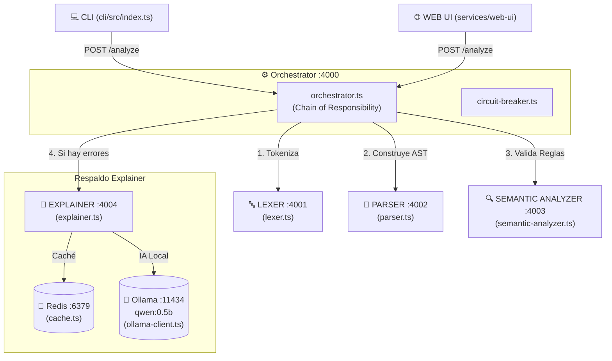

# 🏛️ Arquitectura del Sistema — AI-YAML-Linter

Este documento describe la arquitectura técnica, la distribución de microservicios, los patrones de diseño aplicados y el mapa completo de archivos del proyecto **AI-YAML-Linter**.

---

## 📐 Visión General

El sistema está diseñado como una **arquitectura de microservicios distribuida** basada en una tubería (*pipeline*) secuencial de 3 etapas de análisis (**Léxica → Sintáctica → Semántica**). Las explicaciones pedagógicas de los errores son generadas por un **LLM local (Ollama + qwen:0.5b)** asistido por un sistema de caché en **Redis**.

---

## 🎯 Patrones de Diseño Implementados

El sistema integra 8 patrones de diseño:

| Patrón | Ubicación Principal | Propósito |
|---|---|---|
| **Chain of Responsibility** | `services/orchestrator/src/orchestrator.ts` | Ejecución secuencial del pipeline (Lexer ➔ Parser ➔ Semantic). Se detiene inmediatamente si una etapa produce errores. |
| **Facade** | `services/orchestrator/src/index.ts` | El endpoint `/analyze` simplifica la interacción para clientes (CLI / Web UI), ocultando la complejidad de coordinar 4 microservicios. |
| **Circuit Breaker** | `services/orchestrator/src/circuit-breaker.ts` | Aísla caídas y retardos entre microservicios, evitando fallos en cascada. |
| **Strategy** | `services/semantic-analyzer/src/semantic-analyzer.ts` | Permite agregar o modificar reglas de validación sin alterar el motor principal de análisis. |
| **Decorator** | `services/explainer/src/cache.ts` | Añade funcionalidad de almacenamiento en caché envolviendo las llamadas al LLM. |
| **Repository** | `services/explainer/src/cache.ts` | Abstrae la persistencia en Redis de la lógica del generador de explicaciones. |
| **Adapter** | `services/explainer/src/ollama-client.ts` | Transforma y adapta las llamadas HTTP entre el formato del sistema y la API de Ollama. |
| **Builder** | `services/orchestrator/src/orchestrator.ts` | Construye progresivamente el reporte final de errores con campos opcionales. |

---

## 📂 Mapa de Archivos Principales por Componente

### 1. 🔤 Tokenizador / Análisis Léxico (`services/lexer`)
Convierte el texto YAML crudo en tokens (`KEY`, `COLON`, `STRING`, `NEWLINE`, etc.).
- 📄 [lexer.ts](file:///home/justin/Desktop/Programas/AI-YAML-Linter/services/lexer/src/lexer.ts): **Tokenizador principal**. Analiza el string carácter por carácter y detecta errores léxicos (`LEX-001` tabs+espacios, `LEX-002` caracteres inválidos).
- 📄 [index.ts](file:///home/justin/Desktop/Programas/AI-YAML-Linter/services/lexer/src/index.ts): Servidor Express HTTP (`puerto 4001`).

### 2. 🌳 Parser / Construcción del AST (`services/parser`)
Toma los tokens del Lexer y construye el **Árbol de Sintaxis Abstracta (AST)**.
- 📄 [parser.ts](file:///home/justin/Desktop/Programas/AI-YAML-Linter/services/parser/src/parser.ts): **Constructor del AST**. Valida la estructura sintáctica (`PAR-001` token inesperado, `PAR-002` falta de colones `:`).
- 📄 [index.ts](file:///home/justin/Desktop/Programas/AI-YAML-Linter/services/parser/src/index.ts): Servidor Express HTTP (`puerto 4002`).

### 3. 🔍 Validador Semántico (`services/semantic-analyzer`)
Valida el AST contra esquemas JSON (usando `ajv`) y aplica reglas personalizadas.
- 📄 [semantic-analyzer.ts](file:///home/justin/Desktop/Programas/AI-YAML-Linter/services/semantic-analyzer/src/semantic-analyzer.ts): **Motor semántico**. Valida tipos de datos, rangos numéricos (`SEM-002`), valores vacíos y llaves duplicadas.
- 📄 [index.ts](file:///home/justin/Desktop/Programas/AI-YAML-Linter/services/semantic-analyzer/src/index.ts): Servidor Express HTTP (`puerto 4003`).

### 4. 🤖 Generador de Explicaciones LLM (`services/explainer`)
Genera explicaciones en lenguaje natural para los errores detectados.
- 📄 [ollama-client.ts](file:///home/justin/Desktop/Programas/AI-YAML-Linter/services/explainer/src/ollama-client.ts): **Cliente Ollama**. Conecta con la API local de Ollama (modelo `qwen:0.5b` en puerto 11434).
- 📄 [cache.ts](file:///home/justin/Desktop/Programas/AI-YAML-Linter/services/explainer/src/cache.ts): **Caché en Redis**. Evita reconsultar al LLM para errores idénticos ya analizados.
- 📄 [explainer.ts](file:///home/justin/Desktop/Programas/AI-YAML-Linter/services/explainer/src/explainer.ts): Lógica de orquestación de explicaciones.
- 📄 [index.ts](file:///home/justin/Desktop/Programas/AI-YAML-Linter/services/explainer/src/index.ts): Servidor Express HTTP (`puerto 4004`).

### 5. ⚙️ Orquestador del Pipeline (`services/orchestrator`)
Coordinador central del flujo de trabajo del sistema.
- 📄 [orchestrator.ts](file:///home/justin/Desktop/Programas/AI-YAML-Linter/services/orchestrator/src/orchestrator.ts): Ejecuta el flujo secuencial y enriquece los reportes de error con la IA.
- 📄 [circuit-breaker.ts](file:///home/justin/Desktop/Programas/AI-YAML-Linter/services/orchestrator/src/circuit-breaker.ts): Maneja retardos, tiempos de espera y fallos de microservicios.
- 📄 [index.ts](file:///home/justin/Desktop/Programas/AI-YAML-Linter/services/orchestrator/src/index.ts): Servidor Express HTTP (`puerto 4000`).

### 6. 📐 Tipos Compartidos (`shared/types`)
- 📄 [ast.ts](file:///home/justin/Desktop/Programas/AI-YAML-Linter/shared/types/ast.ts): Definición de nodos del AST (`ASTNode`).
- 📄 [token.ts](file:///home/justin/Desktop/Programas/AI-YAML-Linter/shared/types/token.ts): Definición de tokens (`Token`, `TokenType`).
- 📄 [error.ts](file:///home/justin/Desktop/Programas/AI-YAML-Linter/shared/types/error.ts): Estructura estándar de los errores `LintError`.

### 7. 🖥️ Clientes del Usuario
- 📄 [cli/src/index.ts](file:///home/justin/Desktop/Programas/AI-YAML-Linter/cli/src/index.ts): Interfaz de línea de comandos.
- 📄 [services/web-ui/src/index.ts](file:///home/justin/Desktop/Programas/AI-YAML-Linter/services/web-ui/src/index.ts): Servidor proxy Express de la Web UI (`puerto 5000`).
- 📄 [services/web-ui/src/public/index.html](file:///home/justin/Desktop/Programas/AI-YAML-Linter/services/web-ui/src/public/index.html): Frontend estático del editor interactivo.

### 8. 🐳 Infraestructura
- 📄 [docker-compose.yml](file:///home/justin/Desktop/Programas/AI-YAML-Linter/docker-compose.yml): Configuración y puertos de los 8 contenedores Docker.
